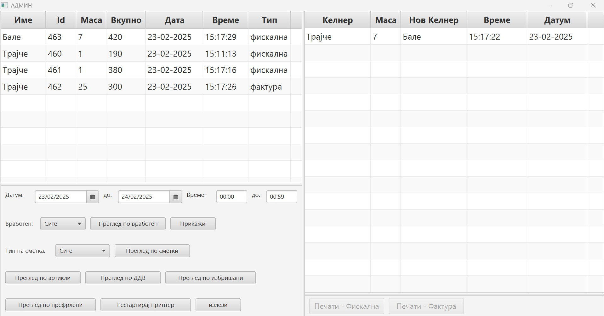

# 🍽️ Restaurant/Bar Management Application

## **Technologies Used**  
`Java` | `JavaFX` | `PostgreSQL`

---

## 🔑 Admin Panel  
### Manage employees and articles for your business.  
- **Secure Access:** Only the admin can access with a password check.  
- **Restricted Actions:** Buttons remain disabled until the correct admin code is entered.  
- **Employee Management:** Add, edit, or delete employees (name, code, type: waiter, bartender, etc.).  
- **Article Management:** Add, edit, or delete articles (name, price, tax, type: bar, kitchen).  

<table align="center">
  <tr>
    <td> <b>Admin Panel</b></td>
    <td> <b>Add/Change Article</b></td>
    <td> <b>Add/Change Employee</b></td>
  </tr>
</table>

---

## 🏠 Login/Home Screen  
### Employees can make orders using their employee code and table number.  
- **Authentication:** Enter a valid employee code to access the order screen.  
- **Table Overview:** Hover over tables to view the total order price and articles.  
- **Order Management:** Click on a table to open or continue an order.  
- **Table Allocation:** Tables are **unique per employee**, meaning different employees can have the same table numbers.  
- **Bill Generation:** Once a bill is generated, the table closes, and the button is removed.  

<table align="center">
  <tr>
    <td> <b>Login/Home Screen</b></td>
  </tr>
</table>

---

## 🛒 Order Screen  
### Employees can manage orders with multiple features.  
- **Quick Search:** Search for articles by name or ID (e.g., "s" finds all articles containing "s"; "1" finds ID 1 or any ID containing "1").  
- **Order Actions:** Add, remove, or transfer articles between tables.  
- **Discount System:** Apply discounts to the entire order.  
- **Table Transfers:**  
  - **Table ➝ Table:** Move an order from Table 22 to Table 24.  
  - **Employee ➝ Employee:** Transfer tables between employees (code verification required).  
- **Order Summary:** Displays employee name, table number, and total order price.  

<table align="center">
  <tr>
    <td> <b>Order Screen</b></td>
    <td> <b>Search Functionality</b></td>
  </tr>
</table>

---

## 📊 Admin Reports & Analytics  
### View financial reports, employee earnings, and tax summaries.  
- **Access:** Enter the admin code and leave the table field empty to enter the admin panel.  
- **Filters:** Select a date range, an employee (or "site" for all), and a bill type (`Fiscal`, `Card`, or `Invoice`).  
- **Detailed Reports:**  
  - **Employee Earnings:** Total cash earned per employee, categorized by bill type.  
  - **Bill Overview:** View all orders within a specific period.  
  - **Article Sales:** Summary of sold articles by quantity and name.  
  - **Tax Report:** Breakdown of total tax collected (18%, 10%, 5%).  
  - **Deleted Items:** Track removed articles from orders.  
  - **Transferred Orders:** See which employee transferred tables and when.  

<table align="center">
  <tr>
    <td> <b>Admin Panel</b></td>
    <td> <b>Bill Overview</b></td>
    <td> <b>Employee Earnings</b></td>
  </tr>
</table>

<table align="center">
  <tr>
    <td> <b>Article Sales</b></td>
    <td> <b>Transferred Orders</b></td>
    <td> <b>Deleted Items</b></td>
    <td> <b>Tax Report</b></td>
  </tr>
</table>

---

## 🚀 Future Improvements  
- **Viber API Integration:** Handle table reservations via Viber messages.  
- **Spring Boot Migration:** Improve backend scalability and efficiency.  
- **Dockerization:** Deploy as a containerized app for better portability.
- Background Printing: Automatically print kitchen and bar orders. ✅ Successfully implemented!

---

### 📌 *A powerful and efficient restaurant management system built with Java & PostgreSQL!*  
